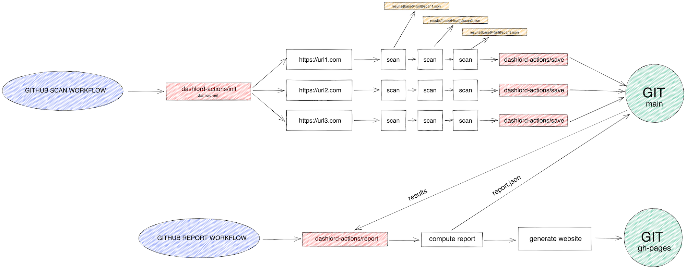

# dashlord-actions

Basic GitHub actions used in [dashlord](https://github.com/socialgouv/dashlord) workflows.

## Actions

| Action           | Usage                                             |
| ---------------- | ------------------------------------------------- |
| check-url        | Check the existence of given URL                  |
| declaration-a11y | verif mention accessibilité                       |
| declaration-rgpd | check mentions légales, CGU, et confidentialité   |
| ecoindex         | Compute webpage ecoscore with green-it            |
| get-html         | get raw HTML of any webpage                       |
| init             | read dashloard.yml                                |
| lhci             | LightHouse collector action                       |
| report           | build a report.json and website from latest scans |
| save             | save a single url scan result for dashlord        |
| sonarcloud       | Extract quality metrics from sonarcloud API       |
| trivy            | Run trivy docker images scanner                   |

And many more !

## How it works

DashLord use GitHub Actions to collect data from different tools and store the results in GIT.

Once all URLs have been scanned, the `report` action generates a `report.json` and a web report which are commited to GIT.

[](https://excalidraw.com/#json=XKFW_JEzkaJWdELtg41vY,jnFgZnfFp_0N_i9wlvzp-A)

## Usage

See [dashlord template repo](https://github.com/socialgouv/dashlord)

## Development

### Start website

```sh
cd report/www
yarn
yarn start
```

### Build a new report

This will add `report.json`, `config.json`, `trends.json` in `report/www/src`
based on the content of `DASHLORD_REPO_PATH` :

```sh
DASHLORD_URLS=http://test1.com,http://test1.com  \ # optional
DASHLORD_REPO_PATH=/path/to/some/dashlord-repo \ #optional
node report/src # this will create fresh config.json, report.json and trends.json for the website
```

See also the [report README](./report/README.md)

### Add a new dashlord action

1. create a GitHub action that can produce some JSON in your `scans/myaction.json`
2. In `report/src/generateUrlReport`, import the minimum from your action JSON to serve it to the frontend via the generated `report.json`
3. In `report/src/summary`, add compute logic for your scanner score.
4. Build a new report.json, see above
5. Run `yarn start` in the `report/www` folder to start adding types from your action and UI for your component
